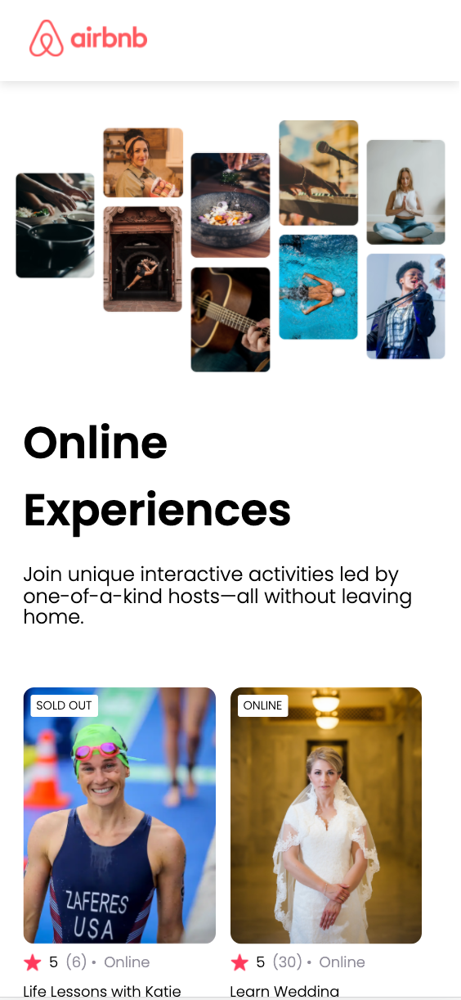

# AirBnb Experiences Clone

This is a clone of Airbnb Experiences page.

## Table of contents

- [Overview](#overview)
  - [The challenge](#the-challenge)
  - [Screenshot](#screenshot)
  - [Link](#link)
- [My process](#my-process)
  - [Built with](#built-with)
- [Author](#author)

## Overview

### The challenge

Users should be able to:

- See various experiences
- See a badge "sold out" if the experience isn't available
- See a badge "online" if the location is online

### Screenshot

### Link

- [Live Site URL](https://miri52.github.io/airbnb-experiences-clone-react/)

## My process

### Built with

- React (create-react-app)
- mobile-first workflow
- data provided inside data.js file

## Author

- LinkedIn - [Miriama Svítková](https://www.linkedin.com/in/miriama-svitkova)
